# MODERN WARFARE

*->"We get dirty and the world stays clean. That's the mission."<-*

## Versions
Number|Season|Splash
-|:-:|:-:
`1.16`|{30%:30%} Season Two|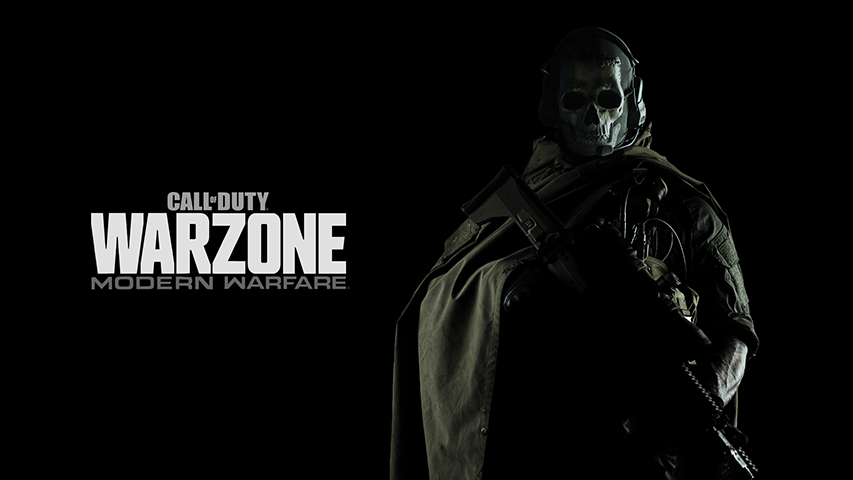{80%:80%}
`1.19`-`20`|{30%:30%} Season Three|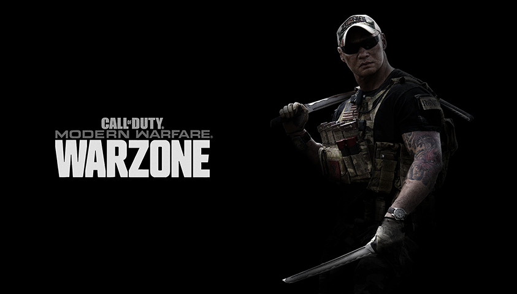{80%:80%}
`1.23`|{30%:30%} Season Four|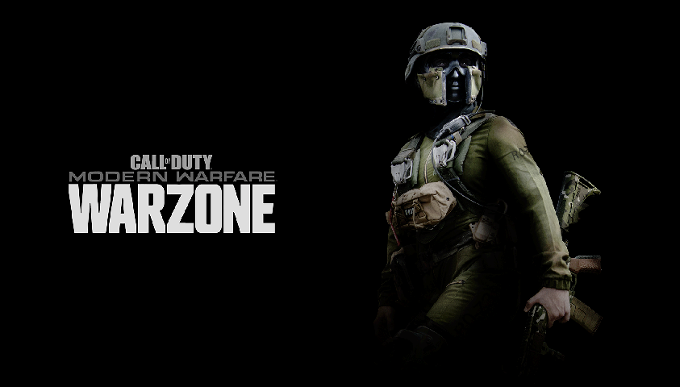{80%:80%}
`1.24`-`6`|{30%:30%} Season Five|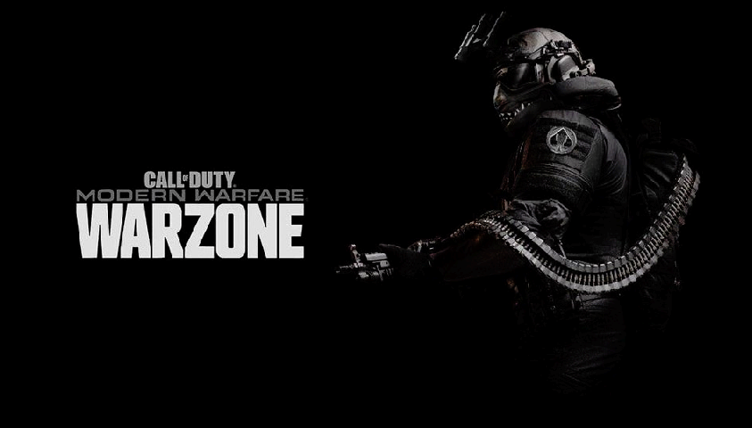{80%:80%}
`1.27`-`8`|{30%:30%} Season Six|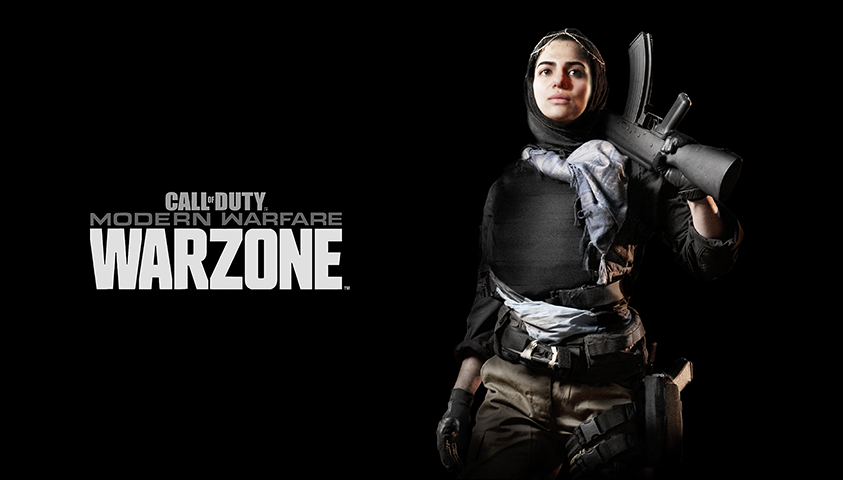{80%:80%}
`1.30`-`1`|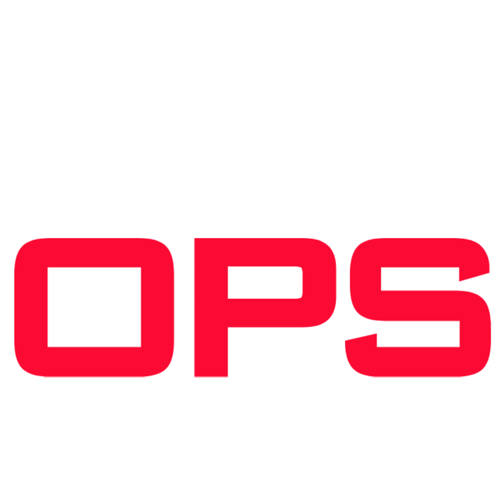{25%:25%} Season One|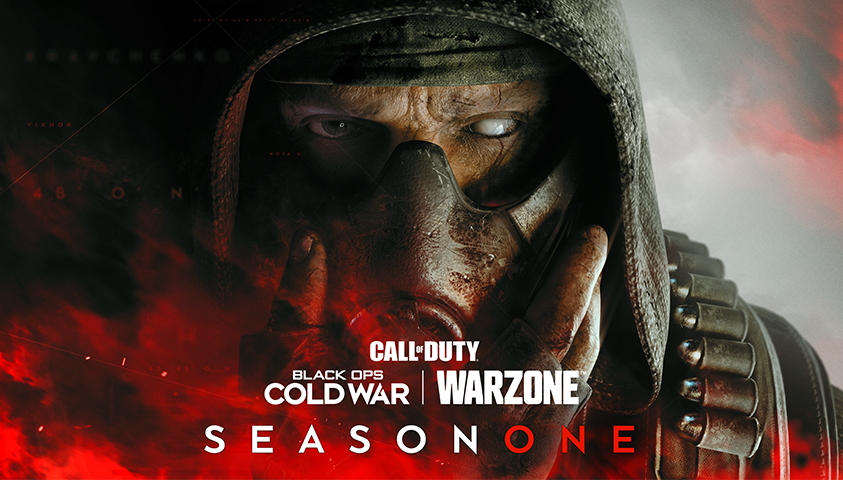{80%:80%}
`1.34`|{25%:25%} Season Two|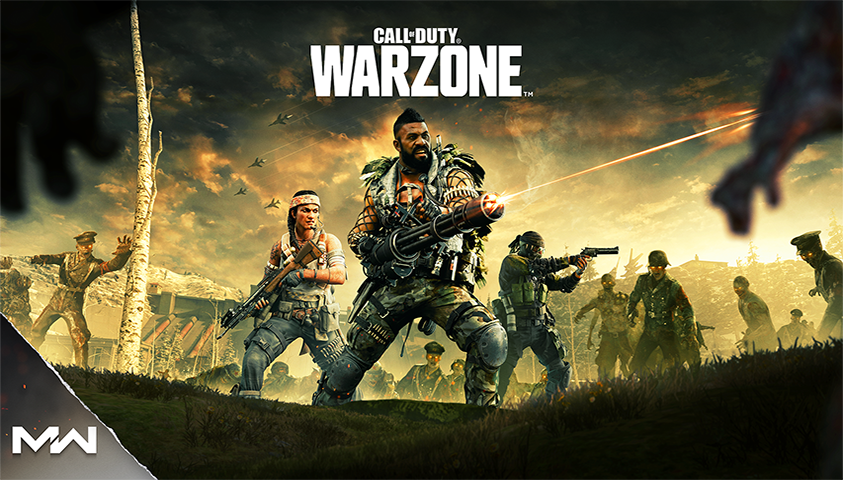{80%:80%}
`1.36`-`7`|{25%:25%} Season Three|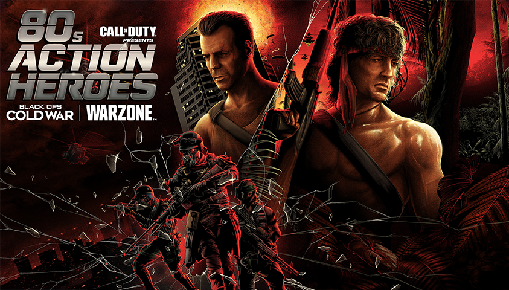{80%:80%}
`1.38`-`9`|{25%:25%} Season Four|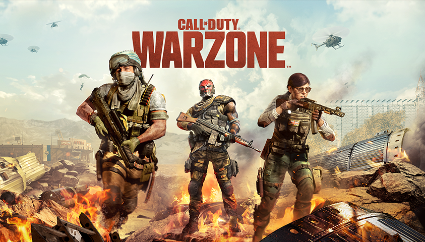{80%:80%}
`1.41`-`2`|{25%:25%} Season Five|{80%:80%}
`1.44`-`5`|{25%:25%} Season Six|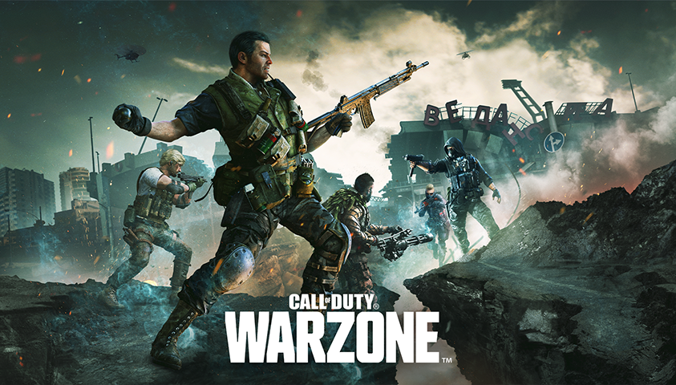{80%:80%}
`1.46`-`51`|{20%:20%} Season One|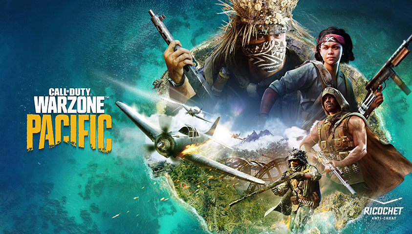{80%:80%}
`1.54`-`6`|{20%:20%} Season Two|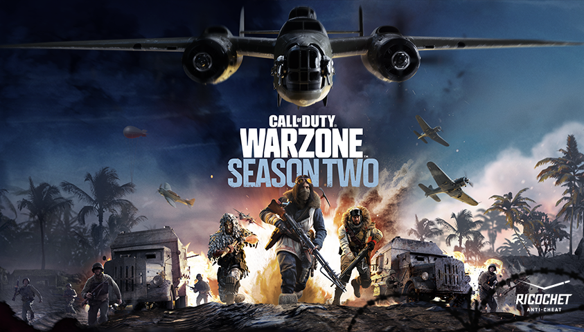{80%:80%}
`1.57`-`8`|{20%:20%} Season Three|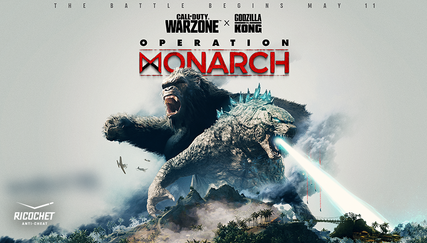{80%:80%}
`1.59`-`61`|{20%:20%} Season Four|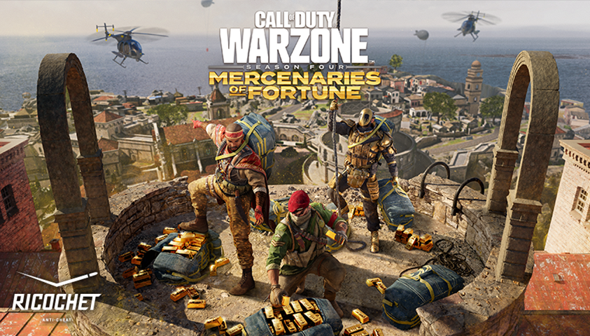{80%:80%}
`1.62`-`64`|{20%:20%} Season Five|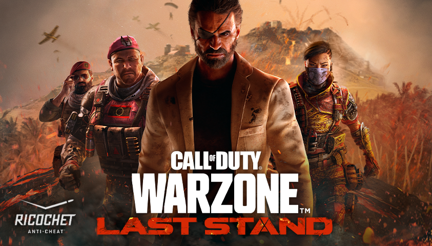{80%:80%}
`1.65`|{20%:20%}|{80%:80%}
`1.67`|Retail|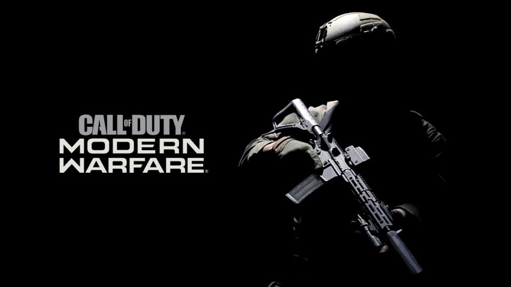{80%:80%}

## Menus
- `openmenu mainlockoutmenu`
- `openmenu mainmenuoffline`
- `openmenu systemlinklobby`
- `openmenu bundlelockermenu`
- `openmenu wzseasonalopeningscreenpc`

## Visuals
- `seta MONKPPPQR`
This defines if the game frontend will be using seasonal assets or not (0-1)
- `r_colorGradingAnalyticalEnable 0; r_whiteBalanceTweaks 1; r_whiteBalanceIlluminant 2`
This will emulate a neutral lighting for the game front end, which can be used to override VG and Cold War colored filters.
- `r_colorGradingAnalyticalEnable 1; r_whiteBalanceTweaks 0; r_whiteBalanceIlluminant 0`
This will restore previous values and return to the default front end lighting.
- `r_tessellation`
This will set the terrain tessellation details render (0-2) this setting is often set to 0 by the engine, you can use it when you want.
- `execution_hint_enabled`
This will show or hide a hint whenever you're able to perform an execution, the UI elements are unfinished in this game (0-1)

## Inventories
- `setPrivateLoadout loadouts 0 name`
Loadout name, example: *setPrivateLoadout loadouts 0 name "Fist of iron"*
- `setPrivateLoadout loadouts 0 weaponSetups 0 weapon`
Weapon setup, example: *setPrivateLoadout loadouts 0 weaponSetups 0 weapon iw8_ar_kilo433*
- `setPrivateLoadout loadouts 0 weaponSetups 0 camo`
Weapon setup camouflage, example: *setPrivateLoadout loadouts 0 weaponSetups 0 camo camo_11a*

### Camouflages
Name|Icon|ID
-|:-:|-
Gold|{90px:90px}|`camo_11a`
Platinum|{90px:90px}|`camo_11b`
Damascus|{90px:90px}|`camo_11c`
Obsidian|{90px:90px}|`camo_11d`

## {6%:6%} WARZONE 
- `set QTQRQPLNK 1;set MLQNQTRRTK 1;set MKQQKMRORQ 16;exec br_core.cfg`
Full Warzone trigger.
- `set LOQQOSNQKN 0;openmenu WarzonePrivateMatchLobby`
Full private match menu, needs some network dependencies.
- `set br_minplayers`
This sets what's the minimum players requirement in order to finish the warmup.
- `set scr_br_gametype`
This manages the game mode of the next match (Read the table below)
- `seta br_kiosk_sales_discount`
This sets a base discount to the buy stations using percents (0-undefined)
- `set scr_br_radar_strength`
This sets the value of minimap radar players indicators (0-4)
- `set scr_br_loadout_option standardammo;set scr_br_allowLoadout 1;set scr_br_use_set_loadouts 1;set scr_br_allowLoadoutOnlyInPreLobby 0`
This enables the possibility of using loadouts for every player/bot in the next match.
- `seta scr_br_use_ww2_announcer`
- `seta scr_br_use_ww2_killstreak_call_in_device`
- `seta scr_br_use_ww2_model_swaps`
These defines if the next match it's going to use specific Vanguard assets or not (0-1)
- `seta scr_br_atlantisNight`
This defines if the next match on escape it's going to use night assets
- `seta scr_escape4_ee_6_2_enabled 1;seta scr_escape4_ee_6_3_enabled 1`
This defines if the next match will open up the secret bunkers under escape 4 by force.

### Game modes
Name|Icon|Full command
-|:-:|-
Battle Royale||`scr_br_gametype br`
Mini Royale||`scr_br_gametype mini`
Juggernaut Royale||`scr_br_gametype jugg`
Armored Royale||`scr_br_gametype truckwar`
Resurgence||`scr_br_gametype rebirth`
Plunder||`scr_br_gametype dmz`
King Slayer||`scr_br_gametype kingslayer`

### Special events
Name|Version|Icon|Full command
-|-|:-:|-
Zombies in Vodianoy|1.34||`Lorem ipsum dolor sit amet, consectetur adipiscing elit`
The Destruction of Verdansk P1|1.34||`seta scr_br_gametype "reveal";seta scr_br_alt_mode_zxp 1`
The Destruction of Verdansk P2|1.34||`set NSQLTTMRMP "mp_escape2_pm";set scr_br_gametype reveal_2`
Verdansk '84 Loot. Kill. Win.|1.34%darkgoldenrod%**¹**%%||`scr_br_gametype brdov`
The Battle of Verdansk|1.41||`seta scr_br_gametype x2;seta scr_wztrain_enable 1;seta scr_wztrain_type armored;seta scr_br_x2_signal_quest_enabled 1`
Ghosts of Verdansk|1.44||`scr_br_gametype gxp;seta scr_br_alt_mode_gxp 1;seta scr_br_gxp_fear 1;seta scr_br_gxp_fear 1;seta scr_br_gxp_phones 2;seta scr_br_safe_zones_enabled 1;seta scr_br_gxp_human_powers 1;seta scr_br_gxp_zombie_drop_tags 1;scr_br_gxp_safezone_hallucinations 1;scr_br_gxp_loop_zombie_fx 1;seta scr_fear_onlootboxjumpscare 1`
Festive Fervor|1.50-2||`exec pr_br_global.cfg;set scr_br_alt_mode_hh 1;set scr_br_ff_xmas_blueprint 1;set scr_br_alt_mode_ff 1;set scr_br_hh_num_trees 12;scr_br_ff_fountain 1;scr_br_quests_enabled 1;set scr_br_events 1;set scr_br_hh_allowRepeatCompletion 0;set scr_br_hh_morse_message 1;set scr_mapHints 1;set scr_br_eas_wait_for_prematch 1;set scr_br_eas_force_use_data_positions 0;set scr_br_ff_elves 1;set disable_elf_collision 0;set scr_br_eas_disable_countdown 1;set scr_br_eas_num_elf_regions_per_map 13;set scr_br_eas_num_elf_buildings_per_region 6;set scr_br_eas_num_lives 3;set scr_br_eas_reward_coal_chance 25;set scr_br_eas_vo_delay 7;set scr_br_eas_countdown 15;set scr_br_eas_stun_range 900;set scr_br_eas_stun_duration 6;set scr_br_eas_start_range 90;set scr_br_eas_max_num_elves -1;set scr_br_ai_encounters 1`
Operation: Monarch|1.57||`scr_br_gametype mendota;seta scr_br_pr_validate_gametypes 0;set scr_br_alt_mode_mendota 1;exec pr_br_mendota.cfg;seta scr_br_alt_mode_mxp 5`
Rebirth of the Dead|1.60+||`set scr_br_gametype "zxp";set scr_br_alt_mode_zxp 1;set scr_br_zxp_numHitsJugg 0;set scr_br_zxp_respawn_shutdown_jugg 0;set scr_br_zxp_jugg_num_players 0;set scr_br_dbd_vehicle_motorcycle 1;set scr_br_zxp_zombiesDamageZombies 1;set scr_br_zxp_health 700;set scr_br_zxp_powers_cooldown 0;set scr_br_zxp_human_powers 1;seta scr_br_pr_validate_gametypes 0;seta scr_br_atlantisNight 1`
Operation: Last Call|1.63+%darkgoldenrod%**²**%%||`scr_br_gametype olaride;seta scr_br_pr_validate_gametypes 0;set scr_br_alt_mode_olaride 1`
!!! warning
¹It requires a controller set as the primary input method as you need to unplug it and plug it back in to get any input.
!!! warning
² 1.63 is a very unstable/broken build, the event will work in post. versions but it might miss some mechanics.
    
### WZ Inventories
- `setWZPrivateLoadout loadouts 0 name`
Loadout name, example: *setWZPrivateLoadout loadouts 0 name "Fist of iron"*
- `setWZPrivateLoadout loadouts 0 weaponSetups 0 weapon`
Weapon setup, example: *setWZPrivateLoadout loadouts 0 weaponSetups 0 weapon iw8_ar_t9accurate*
- `setWZPrivateLoadout loadouts 0 weaponSetups 0 camo`
Weapon setup camouflage, example: *setWZPrivateLoadout loadouts 0 weaponSetups 0 camo camo_mp_t9mastery_gold*

### WZ Camouflages
{25%:25%}
**Cold War, Multiplayer mastery**%darkgoldenrod%¹%%

Name|Icon|ID
-|:-:|-
Gold|{90px:90px}|`camo_mp_t9mastery_gold`
Diamond|{90px:90px}|`camo_mp_t9mastery_diamond`
Dark Matter Ultra|{90px:90px}|`camo_mp_t9mastery_darkmatter`
!!! warning
¹Only available on version 1.30 onwards (Season One)
This version has some early coverage on weapon models.

**Cold War, Zombies mastery** %darkgoldenrod%²%%

Name|Icon|ID
-|:-:|-
Golden Viper|{90px:90px}|`camo_zm_t9mastery_gold`
Plague Diamond|{90px:90px}|`camo_zm_t9mastery_diamond`
Dark Aether|{90px:90px}|`camo_zm_t9mastery_darkmatter`
!!! warning
²Only available on version 1.41 onwards (Season Five)
This version has some early coverage on weapon models.
Some assets of the Dark Aether are broken on version 1.45 onwards.

**Vanguard, Multiplayer mastery**%darkgoldenrod%¹%%

Name|Icon|ID
-|:-:|-
Gold|{90px:90px}|`s4_camo_11a`
Diamond|{90px:90px}|`s4_camo_11b`
Atomic|{90px:90px}|`s4_camo_11c`
?||`s4_camo_11d`

**Vanguard, Zombies mastery**%darkgoldenrod%¹%%

Name|Icon|ID
-|:-:|-
Golden Viper|{90px:90px}|`s4_camo_11a_zm`
Plague Diamond|{90px:90px}|`s4_camo_11b_zm`
Dark Aether|{90px:90px}|`s4_camo_11c_zm`
!!! warning
¹Only available on version 1.46 onwards (Season One)

**Events**

Name|Icon|ID
-|-|-
Titanium Chrome||`s4_camo_titanium_trials_01`
Liquid Metal|{90px:90px}|`s4_camo_titanium_trials_02`
Skynet||`s4_camo_titanium_trials_03`
Death Prospector||`mtl_s4_camo_gold_woodland`
False Protector||`mtl_s4_camo_gold_digital`
