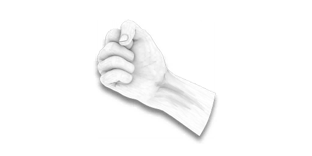
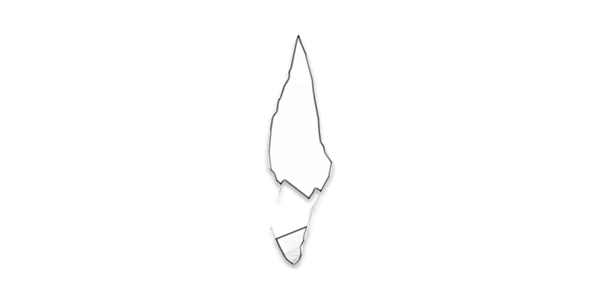
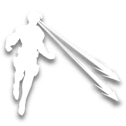
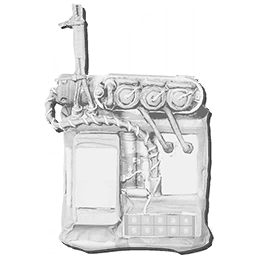
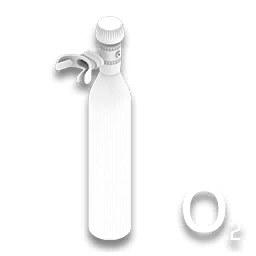
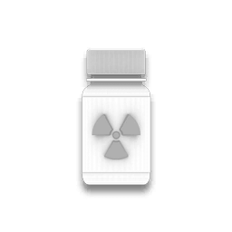
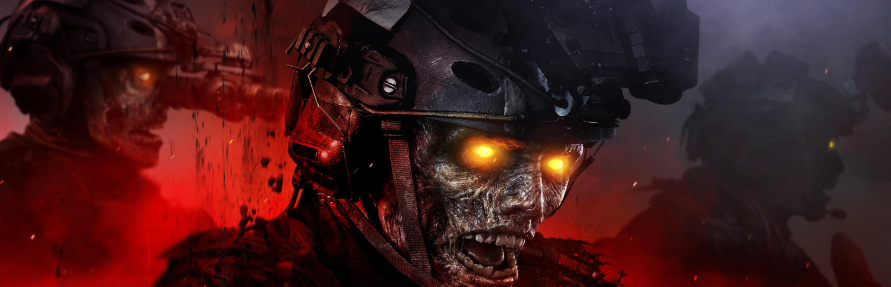
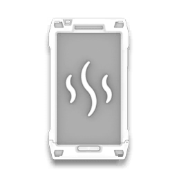

# MODERN WARFARE III

*->"Take this to hell with you, Captain... Never bury your enemies alive."<-*

## Menus
- `luiOpenMenu mainmenuoffline`
- `luiOpenMenu customizemenu`
- `luiOpenMenu musicpackselect`
- `luiOpenMenu mybundleselect`
- `luiOpenMenu systemlinklobby`
- `luiOpenMenu solooperatorselect`
- `luiOpenMenu obplaymenu`
- `luiOpenMenu obloadoutmanagement`

## Visuals
- `seta #x3879E55ACF9D60DEB`
This displays the Halloween themed Season Six HUD, in the next multiplayer match (0-1)
- `#x3BB4DBC0D6A10A598`
This displays the Call of Duty Endowment banner in the countdown after the warmup, in the next WZ 2.0 match (0-1)
- `lui_channels_enabled`
- `lui_notifications_enabled`
These defines if the top right menu will display various buttons, or not (0-1)
- `#x3f1453ba49333b368`
This defines if the reactive operator skins, and weapon blueprints, will render particles, or not (0-1)
- `lui_recommended_weapons_enabled`
This will show/hide the recommended weapons flairs from the current build (0-1)
- `lui_atvi_clantag_icons_enabled`
This will show/hide the clan tag icons for COD studios if chosen (0-1)
- `r_dof_enable`
This will enable/disable depth of field.
- `r_ssrsamplecount 900`
This will try to fix blurry screen space reflections by increasing the sample count.
- `r_ssrsamplecount 64`
This will restore previous values and return to the default sample count.
- `set bot_use_vanilla_name`
This will enable/disable Bot names used in WZ 2.0 in every possible mode, disabled by default (0-1)
- `set com_showbottag`
This will enable/disable the [bot] prefix for bots in every possible mode, enabled by default (1-0)
- `cg_drawdevoverlays`
This will show/hide developer info in an overlay (0-1)
- `lui_enable_gun_effect_preview_firing_range`
This defines if the weapon preview from the firing range will display or not a tracers preview window like in bundle menus (0-1)
- `lui_use_lua_subtitle_impl`
This defines if an icon will display on specific subtitles, unfinished and early BO6 implementation, disabled by default (0-1)
- `r_globalSnow 1`
Experimental, this will render snow textures on the whole game, can affect all kind of maps.

## Inventories
**Private matches**
- `setJupiterPrivateLoadout loadouts 0 name`
Loadout name, example: *setJupiterPrivateLoadout loadouts 0 name "Fist of iron"*
- `setJupiterPrivateLoadout loadouts 0 weaponSetups 0 weapon`
Weapon setup, example: *setJupiterPrivateLoadout loadouts 0 weaponSetups 0 weapon jup_jp19_ar_acharlie*
- `setJupiterPrivateLoadout loadouts 0 weaponSetups 0 camo`
Weapon setup camouflage, example: *setJupiterPrivateLoadout loadouts 0 weaponSetups 0 camo jup_camo_comp_01*
- `setJupiterPrivateLoadout loadouts 0 equipmentSetups 0 equipment`
Equipment setup, example: *setJupiterPrivateLoadout loadouts 0 equipmentSetups 0 equipment equip_frag*
- `setJupiterPrivateLoadout loadouts 0 fieldUpgradeSetups 0 fieldUpgrade`
Field upgrade setup, example: *setJupiterPrivateLoadout loadouts 0 fieldUpgradeSetups 0 fieldUpgrade super_deadsilence*
**Public matches**
- `setJupiterPublicLoadout loadouts 0 name`
Loadout name, example: *setJupiterPublicLoadout loadouts 0 name "Fist of iron"*
- `setJupiterPublicLoadout loadouts 0 weaponSetups 0 weapon`
Weapon setup, example: *setJupiterPublicLoadout loadouts 0 weaponSetups 0 weapon jup_jp19_ar_acharlie*
- `setJupiterPublicLoadout loadouts 0 weaponSetups 0 camo`
Weapon setup camouflage, example: *setJupiterPublicLoadout loadouts 0 weaponSetups 0 camo jup_camo_comp_01*
- `setJupiterPublicLoadout loadouts 0 equipmentSetups 0 equipment`
Equipment setup, example: *setJupiterPublicLoadout loadouts 0 equipmentSetups 0 equipment equip_frag*
- `setJupiterPublicLoadout loadouts 0 fieldUpgradeSetups 0 fieldUpgrade`
Field upgrade setup, example: *setJupiterPublicLoadout loadouts 0 fieldUpgradeSetups 0 fieldUpgrade super_deadsilence*

### Exclusive weapons
Name|Icon|ID
-|:-:|-
Nothing||`iw9_gunless_mp`
Fists||`iw9_drown`
Fists (old)||`iw8_fists_mp_zmb`
Minigun||`iw9_lm_dblmg`
Arcade Riveter||`setJupiterPrivateLoadout loadouts 0 weaponSetups 0 weapon jup_cp01_sh_aromeo410;setJupiterPrivateLoadout loadouts 0 weaponSetups 0 attachmentSetup 0 attachment jup_ammo_410g_vortex`
Arcade MORS||`setJupiterPrivateLoadout loadouts 0 weaponSetups 1 weapon jup_jp35_sn_moscar;setJupiterPrivateLoadout loadouts 0 weaponSetups 1 attachmentSetup 0 attachment jup_jp35_sn_moscar_bar_explode`
Stim pistol||`iw9_pi_stimpistol`
Glass shard||`jup_me_glassshiv`
Laser Vision (Temp V)||`super_laser_charge_mp`
Rock||`rock_mp`
Buzzsaw||`iw9_me_buzzsaw_mp`
EMP bomb||`iw9_cyberemp`
Rebreather||`iw9_oxygenmask_mp`
Iodine pills||`iodine_pills_mp`

### Exclusive field upgrades
Name|Icon|ID
-|:-:|-
Empty slot||`none`
Stim pistol||`super_stimpistol`
Oxygen mask||`super_oxygen_mask`
Haunted box||`super_haunted_drop`

### Camouflages
Multiplayer mastery
Name|Icon|ID
-|:-:|-
Gilded|{90px:90px}|`jup_camo_comp_01`
Forged|{90px:90px}|`jup_camo_comp_02`
Priceless|{90px:90px}|`jup_camo_comp_03`
Interstellar|{90px:90px}|`jup_camo_comp_04`

Weapon Prestige
Name|Icon|ID
-|:-:|-
One Trick|{90px:90px}|`jup_camo_prest_01`
Molten Obsidian|{90px:90px}|`jup_camo_prest_02`
Mercury|{90px:90px}|`jup_camo_prest_03`
Constellation's End|{90px:90px}|`jup_camo_prest_04`

MWII Multiplayer mastery
Name|Icon|ID
-|:-:|-
Gold|{90px:90px}|`camo_comp_01`
Platinum|{90px:90px}|`camo_comp_02`
Polyatomic|{90px:90px}|`camo_comp_03`
Orion|{90px:90px}|`camo_comp_04`

Events
Name|Icon|ID
-|:-:|-
Gridlocked|{90px:90px}|
Shifting Grid|{90px:90px}|
Synth-Bust|{90px:90px}|

## MODERN WARFARE ZOMBIES

*->"No one gets in, nothin' - I mean, nothin' gets out. Clear?"<-*

- `cl_transientcollision_memorybudgetgame 224288000;cl_transientcollision_maxtilesoverride 64;scr_default_maxagents 64;ui_serverframeduration 16;ui_physicsframeduration 16`
Stability values.
- `set ob_devuav`
This defines if the next match will display hostiles on the mini map persistently.
- `set party_maxsquadsize`
- `set party_maxplayers`
This will define the number of players/squads on your team, using the same value for both will let you play duos/quads/trios with bots (0-4)
- `seta enable_automation_bot`
This will define if bots can perform specific actions like shooting and aiming, in the next match, it's disabled by default (0-1)
- `set bot_enablenopathnodebehavior`
This will define if bots can't follow a path and track hostiles, in the next match, it's enabled by default (1-0)
- `seta #x32fe0283b419ff08a`
This defines if the Urzikstan helicopter infil animation plays, in the next match, enabled by default (0-1)

### Story Missions
- `set ui_mapname mp_jup_st_c_gw;seta ob_quest1_act1 1`
**Act I**: Welcome to Operation Deadbolt (Exfil Dr. Jansen)
- `set ui_mapname mp_jup_resort_gw;seta ob_quest1_act2 1`
**Act II**: Mother of Invention (Test Site)
- `set ui_mapname mp_jup_gw_fallout;seta ob_quest1_act3 1`
**Act III**: Confrontation (Confront Zakhaev)
- `seta ob_quest1_act1 0;seta ob_quest1_act2 0;seta ob_quest1_act3 0;seta ob_rift_run 0;seta ob_s5_rift_run 0;seta ob_rift_story_mission_s1 0;seta #x373cfb77eb49c943 0;seta ob_unstable_rift 0;seta ob_s3_rift_run 0;seta ob_rift_story_mission_s5 0;seta ob_rift_story_mission_s3 0`
**Clear mission selection**
- `seta #x373cfb77eb49c943 1`
**Hard Rift mode**
- `set ui_mapname mp_jup_fort;seta ob_rift_story_mission_s1 1`
Season 1 - Rift
- `set ui_mapname mp_jup_sira;seta ob_s2_rift_run 1`
Season 2 - Rift
- `set ui_mapname mp_jup_hydro;seta ob_rift_story_mission_s3 1`
Season 3 - Rift Story
- `set ui_mapname mp_jup_hydro;seta ob_s3_rift_run 1`
Season 3 - Rift
- `set ui_mapname mp_jup_fort;seta ob_unstable_rift 1`
Season 4 - Unstable Rift
- `set ui_mapname mp_jup_tower;seta ob_rift_story_mission_s5 1`
Season 5 Rift Story
- `set ui_mapname mp_jup_tower;seta ob_rift_run 1;seta ob_s5_rift_run 1`
Season 5 Rift

### MWZ Inventories
- `setOutbreakLoadout loadouts 0 weaponSetups 0 weapon`
Weapon setup, example: *setOutbreakLoadout loadouts 0 weaponSetups 0 weapon jup_jp19_ar_acharlie*
- `setOutbreakLoadout loadouts 0 weaponSetups 0 camo`
Weapon setup camouflage, example: *setOutbreakLoadout loadouts 0 weaponSetups 0 camo jup_camo_ob_comp_01*
- `setOutbreakLoadout loadouts 0 equipmentSetups 0 equipment`
Equipment setup, example: *setOutbreakLoadout loadouts 0 equipmentSetups 0 equipment equip_frag*
- `setOutbreakLoadout loadouts 0 fieldUpgradeSetups 0 fieldUpgrade`
Field upgrade setup, example: *setOutbreakLoadout loadouts 0 fieldUpgradeSetups 0 fieldUpgrade super_aether_shroud*
**In-match**
- `set scr_start_currency`
Set the amount of essence the players/bots will have in the next match, affects the whole squad (0-2147483647)
- `seta cheat_give_cash`
This will give you a specific ammount of essence in match (0-2147483647)
- `seta cheat_give_equipment`
This will drop a specific equipment in match, next to you.
- `seta cheat_force_power_level`
This will enable a developer cheat for all players/bots with high value loot, depending on the number, and based on the danger zone loot. Can be used once per weapon upgrade (0-3)
- `seta #x3c71b67e0a3ba8ac6 1`
This will enable a developer cheat that will drop next to you every acquisition.
- `seta #x3e169afa3c29fa095 1`
This will enable a developer cheat that will drop next to you every relic.
- `seta #x373cb4ab372e0194a 1`
This will enable a developer cheat that will drop next to you every ammo mod.

### Acquisitions
**Perk-a-Cola cans**
Name|Icon|ID
-|:-:|-
Juggernog||`ob_jup_item_perk_juggernog`
Quick Revive||`ob_jup_item_perk_quickrevive`
Speed Cola||`ob_jup_item_perk_speedcola`
Staminup||`ob_jup_item_perk_staminup`
Deadshot Daiquiri||`ob_jup_item_perk_deadshot`
PhD Flopper||`ob_jup_item_perk_phd_flopper`
Tombstone Soda||`ob_jup_item_perk_tombstone`
Elemental Pop||`ob_jup_item_perk_elemental_pop`
Death Perception||`ob_jup_item_perk_death_perception`

**Aetherium**
Name|Icon|ID
-|:-:|-
Uncommon Aether Tool||`ob_jup_item_aether_tool`
Rare Aether Tool||`ob_jup_item_aether_tool_2`
Epic Aether Tool||`ob_jup_item_aether_tool_3`
Legendary Aether Tool||`ob_jup_item_aether_tool_4`
Raw Aetherium Crystal||`ob_jup_item_aether_crystal`
Refined Aetherium Crystal||`ob_jup_item_aether_crystal_2`
Flawless Aetherium Crystal||`ob_jup_item_aether_crystal_3`

**Ammo Mods**
Name|Icon|ID
-|:-:|-
Brain Rot||`ob_jup_item_ammomod_bainrot`
Cryo Freeze||`ob_jup_item_ammomod_cryofreeze`
Dead Wire||`ob_jup_item_ammomod_deadwire`
Napalm Burst||`ob_jup_item_ammomod_napalmburst`
Shatter Blast||`ob_jup_item_ammomod_shatterblast`

**Wonder Weapons cases**
Name|Icon|ID
-|:-:|-
Ray Gun||`ob_jup_item_weaponcase_raygun`
Scorcher||`ob_jup_item_weaponcase_plasmagun`
VR11||`ob_jup_item_weaponcase_vr11`
Wunderwaffe DG-2||`ob_jup_item_weaponcase_dg2`

**Classified**
Name|Icon|ID
-|:-:|-
Aether Blade case||`ob_jup_item_weaponcase_aetherblade`
Dead Wire Detonators||`ob_jup_item_warlord_maestro_mod`
Disciple Bottle||`ob_jup_item_disciple_bottle`
Dog Bone||`ob_jup_item_dog_whistle`
Golden Armor plate||`ob_jup_item_golden_armor_plate`
Golden Mask Filter||`ob_jup_item_warlord_chemist_mask`
Grenade Bandolier||`ob_jup_item_grenade_bandolier`
Mag of Holding||`ob_jup_item_golden_ammo`
Sergeant's Beret||`ob_jup_item_warlord_afo_beret`

**Military loot**
Name|Icon|ID
-|:-:|-
Armor Plate||`ob_jup_item_armor_plate`
Self Revive||`ob_jup_item_revive_self_revive`
2-Plate Armor Vest||`ob_jup_item_plate_carrier_2`
3-Plate Armor Vest||`ob_jup_item_plate_carrier_3`
Medium Rucksack||`ob_jup_item_backpack_medium`
Large Rucksack||`ob_jup_item_backpack_large`
Gas Mask||`ob_jup_item_gasmask`
Durable Gas Mask||`ob_jup_item_gasmask_durable`
Monkey Bomb||`ob_jup_item_tactical_monkey_bomb`
LT53 Kazimir||`ob_jup_item_tactical_blackhole_bomb`
Juggernaut||`ob_jup_item_killstreak_juggernaut`
Precision Airstrike||`ob_jup_item_killstreak_precision_airstrike`
Sentry Gun||`ob_jup_item_killstreak_sentrygun`
Cluster Mine||`ob_jup_item_killstreak_cluster_spike`
Mortar Strike||`ob_jup_item_killstreak_clusterstrike`
Termal Phone|)|`ob_jup_item_thermal_phone`

### WANDS
Name|Icon|ID
-|:-:|-
Empty slot||`none`
Energy mine||`super_energy_mine`
Frenzied guard||`super_frenzied_guard`
Healing aura||`super_healing_aura`
Frost blast||`super_frost_blast`
Aether shroud||`super_aether_shroud`
Tesla Storm||`super_tesla_storm`

### Wonder weapons
Name|Icon|ID
-|:-:|-
Ray Gun||`jup_pi_raygun`
Ray Gun (WZ)||`jup_pi_goldengun`
Scorcher||`jup_la_plasmagun`
Wunderwaffe DG-2||`jup_ar_dg2`
V-R11||`jup_la_humangun`

### MWZ Camouflages
Events
Name|Icon|ID
-|:-:|-
Mark of the Survivor|{90px:90px}|`jup_camo_n4942_1`

Mastery
Name|Icon|ID
-|:-:|-
Golden Enigma|{90px:90px}|`jup_camo_ob_comp_01`
Zircon Scale|{90px:90px}|`jup_camo_ob_comp_02`
Serpentinite|{90px:90px}|`jup_camo_ob_comp_03`
Borealis|{90px:90px}|`jup_camo_ob_comp_04`

MWII Mastery
Name|Icon|ID
-|:-:|-
Golden Ivory|{90px:90px}|`jup_camo_ob_iw9_comp_01`
Spinel Husk|{90px:90px}|`jup_camo_ob_iw9_comp_02`
Arachnida|{90px:90px}|`jup_camo_ob_iw9_comp_03`
Bioluminescent|{90px:90px}|`jup_camo_ob_iw9_comp_04`

## WARZONE 2.0

*->"Let's get this done."<-*

- `exec br_core.cfg;exec br_globals.cfg`
Execute WZ 2.0.
- `exec #x43B0AD900F42FF5D5`
Needed for Urzikstan WZ 2.0 matches.
- `live_lobby_minplayers_start`
This sets what's the minimum players requirement in order to finish the warmup.
- `set lui_show_loading_hints`
This disables/enable the next game mode hints, in the next match. (0-1)
- `set ui_serverframeduration 16,set ui_physicsframeduration 16`
Sets the right physics values for miscellaneous entities like drones, in the next match.
- `cl_transientcollision_memorybudgetgame 224288000;cl_transientcollision_maxtilesoverride 64`
Sets the right collisions on Resurgence maps, like Vondel's train, in the next match.
- `scr_br_third_person_toggle`
This disables/enable third person button option on the pause menu, in the next match.
- `scr_br_playtest_tool_phoenix`
This disables/enable a developer tool kit in the next match, most of the stuff won't work, visual only.
- `seta scr_br_bunker_doors_show_graffiti`
- `seta scr_br_bunker_doors_show_documents`
These defines if the next match it's going to use specific BO6 reveal assets or not (0-1)

### Game modes
Name|Icon|Full command
-|:-:|-
Battle Royale||`ui_gametype br`
Mini Royale||`ui_gametype mini`
Resurgence||`ui_gametype resurgence`
Plunder||`ui_gametype plunder`
Zombie Royale||`ui_gametype zxp`
Purgatory||`ui_gametype limbo`
Totally The Same BR||`ui_gametype br;bg_brIsTotallyNormal 1`
